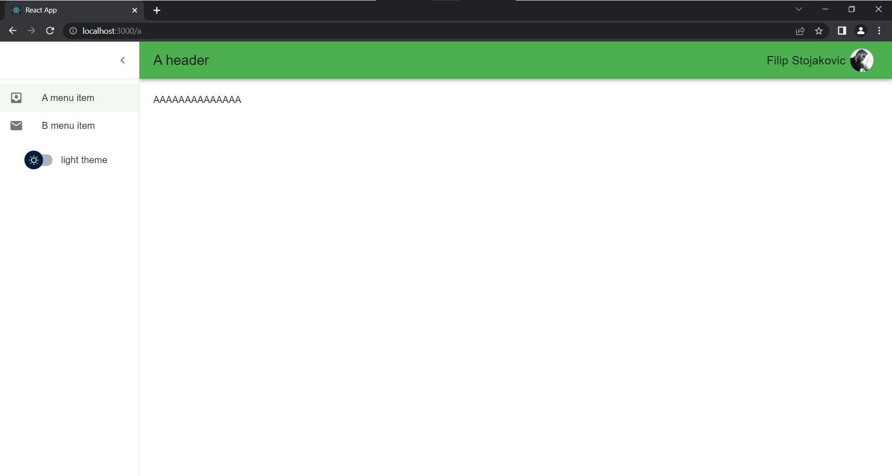
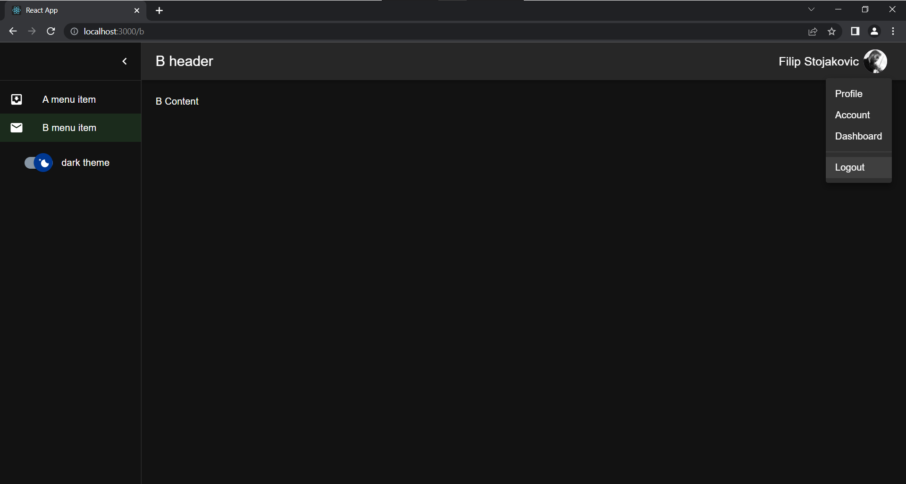
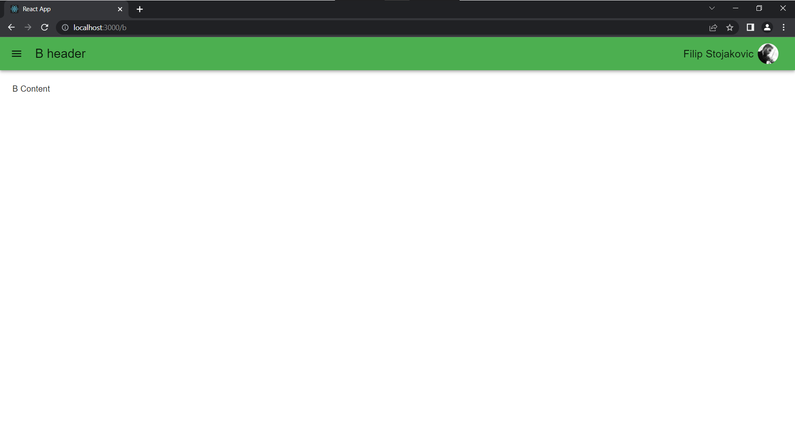

# MUI v5 (Material UI) Drawer Template

This is a simple React TypeScript application that uses mui v5 (material ui v5) and react-router-dom v6.

You can either use an existing project code base, fork a project, or start from scratch.

